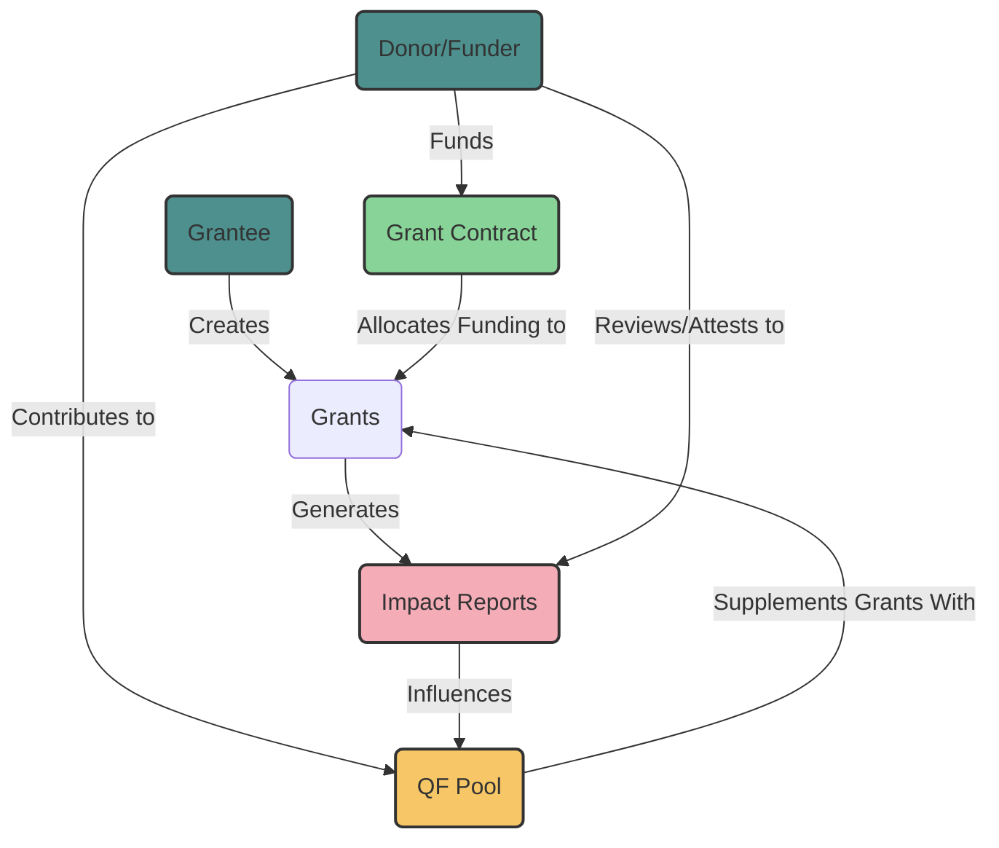

# IMPS - Impact Measurement Protocols

IMPS (Impact Measurement Protocols) is Ninit's first iteration of a custom Grant Stack application, leveraging Scaffold-Eth-2 and custom Allo V1 contracts. It aims to simplify the onboarding experience into web3 with Quadratic Funding (QF) rounds while providing additional resources and tooling for communities to subjectively measure impact under specific conditions with fairly weighted votes.

## Project Overview

IMPS is a subjective measurement system designed to analyze and assess impact, using that data to hold projects accountable for poor impact reporting or failure to deliver on promises. It's particularly useful with Streaming Quadratic Funding (SQF) and interesting to implement in direct single-funder (SF) donations outside of QF pools.

Built using Scaffold-Eth-2 and inspired by Allo V1, IMPS makes it easier for developers to fork and customize their own accountable funding mechanism or QF grant stack. This project is a more built-out and customized variation of our Scaffold-Grant-Stack application.

### Key Features

- **Impact Attestation**: Donors can attest to a project's impact with a revocable statement.
- **Weighted Voting**: Vote weight is calculated based on the donor's contribution ratio to the project.
- **Customizable Rounds**: Implement saved and custom round settings for simplified setup.
- **Informational Tooltips**: Added explanations for contract functions.
- **Streaming Functionality**: Implement streamlined (DCA-like) funding into QF and SF rounds.
- **SQF Integration**: Implement SQF features for donations beyond Allo V1.

## Mathematical Model

The overall weighted score of a project is calculated as follows:
ProjectScore = Σ (VoterScore * (VoterContribution / TotalProjectFunding))
Where:
VoterScore: Individual voter's impact score (e.g., 1-10)
VoterContribution: Amount contributed by the voter
TotalProjectFunding: Total funding received by the project
Copy
## Getting Started

### Requirements

- [Node (>= v18.17)](https://nodejs.org/en/download/)
- [Yarn (v1 or v2+)](https://yarnpkg.com/getting-started/install)
- [Git](https://git-scm.com/downloads)

### Installation and Setup

1. Clone the repository:
git clone https://github.com/Novus-Initium/IMPs
cd imps
yarn install
Copy
2. Start a local network:
yarn chain
Copy
3. Deploy the test contract:
yarn deploy
Copy
4. Start the NextJS app:
yarn start
Copy
Visit `http://localhost:3000` to interact with your smart contract.

## Technology Stack

Built using NextJS, RainbowKit, Hardhat, Wagmi, Viem, Allo V1, EAS, and others.

## Core Components

1. **User Profiles and Identity Management**
- Registry Contract: Manages user profiles with specific roles and permissions.
- Anchor Contracts: Securely manage interactions with external addresses and handle funds.

2. **Grant Creation and Management**
- Grant Contracts: Allow creation of grants, proposal submissions, and linking of impact reports.

3. **Impact Reporting and Attestation**
- Impact Reports: Submitted using hypercert technology, verifiable through Ethereum Attestation Service (EAS).
- Attestation System: Decentralized review system for report validation.

4. **Voting and Fund Allocation**
- Voting Contracts: Enable voting on perceived impact of grants.
- Quadratic Funding Pool: Adjusts fund distribution based on weighted votes.

5. **Custom Strategies and Governance**
- Custom Strategies: Manage fund allocation based on impact reports and votes.
- Governance Mechanisms: Enhance transparency and accountability in capital allocation.

## Future Goals

- Implement saved and custom round settings for easier setup.
- Add informational hover-overs to explain contract functions.
- Implement streamlined funding into QF rounds with governance over unallocated funds.
- Integrate SQF features for donations beyond Allo V1.

## About Us

Our team consists of experienced developers and experts in the Political and DeFi space. With a shared history in working with non-profits and tracking federal grant funding, we are passionate about using technology for social good.

Crafted by Ninit.

