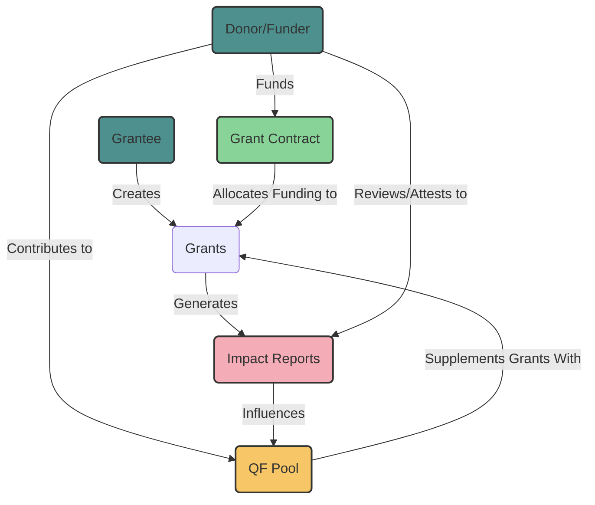

# Imps - Impact Measurement Protocols

🤖 Built using Scaffold-Eth-2 

TEST

## Requirements

Before you begin, you need to install the following tools:

- [Node (>= v18.17)](https://nodejs.org/en/download/)
- Yarn ([v1](https://classic.yarnpkg.com/en/docs/install/) or [v2+](https://yarnpkg.com/getting-started/install))
- [Git](https://git-scm.com/downloads)
1. Clone this repo & install dependencies

```
git clone https://github.com/MekailTheMachine/imps
cd imps
yarn install
```

2. Run a local network in the first terminal:

```
yarn chain
```

This command starts a local EVM Network using Hardhat. The network runs on your local machine and can be used for testing and development. You can customize the network configuration in `hardhat.config.ts`.

3. On a second terminal, deploy the test contract:

```
yarn deploy
```

This command deploys a test smart contract to the local network. The contract is located in `packages/hardhat/contracts` and can be modified to suit your needs. The `yarn deploy` command uses the deploy script located in `packages/hardhat/deploy` to deploy the contract to the network. You can also customize the deploy script.

4. On a third terminal, start your NextJS app:

```
yarn start
```

Visit your app on: `http://localhost:3000`. You can interact with your smart contract.

⚙️ Built using NextJS, RainbowKit, Hardhat, Wagmi, Viem, AlloV2, EAS, ERC1155 Hypercerts and more. 

# Features

User Profiles and Identity Management

Registry Contract: To create and manage user profiles (donors, funders, grantees) with specific roles and permissions.
Anchor Contracts: Deployed for each profile to securely manage interactions with external addresses and handle funds.
Grant Creation and Management

Grant Contracts: Allow grantees to create grants, submit proposals, and link impact reports and updates directly to their grants.
Impact Reporting and Attestation

Impact Reports: Grantees submit periodic impact reports using hypercert technology, which are verifiable through Ethereum Attestation Service (EAS).
Attestation System: Donors and funders attest to the validity and effectiveness of these reports, creating a decentralized review system.
Voting and Fund Allocation

Voting Contracts: Enable donors and funders to vote on the perceived impact of grants based on submitted reports.
Quadratic Funding Pool (QF Pool): Adjusts the distribution of funds to grants based on the weighted votes from donors and funders.
Custom Strategies and Governance

Custom Strategies: Implement strategies within the Allo contract to manage fund allocation, incorporating feedback from impact reports and votes.
Governance Mechanisms: Ensure transparency and accountability by providing tools for enhanced governance within capital allocation and impact reporting.


# Abstract

Poor social health, poverty, lack of social programs, and overall coordination lie at the roots of our inability to healthily progress as a species. Giving citizens more political power and insights into the inner mechanics of their social systems is now more possible than ever.

In our pursuit of enhancing community engagement, we must carefully consider the operating systems and models underpinning our communities and organizations. These systems, which have evolved over thousands of years, remain central to our collective existence. Yet, the opaque and arcane nature of many of these systems often undermines trust and inhibits meaningful community interaction. This opacity and lack of coordination can discourage engagement and make it difficult and inefficient to operate. With today’s technology, we have the power to mitigate many of the social issues described above, even litigatory behavior amongst HOAs and Homeowners, Non-profits, and more. To generate more trust, participation, and symbiosis within our underlying social infrastructures, we must focus on the development of our political infrastructures, underlying governance models, and approaches on bridging the two.

## Objective

Our goal is to close the transparency and accountability gaps in traditional public goods funding mechanisms. This will make funding more efficient and strengthen the bond between funders, donors, grantees, and their communities, fostering a sense of ownership, community, and purpose. We believe that this innovative approach can help increase public good funding and support important causes. We would like to provide tools and resources for enhanced governance within capital allocation and impact reporting.

## How

This can be accomplished by integrating systems where grantees can link tangible proof of their work directly to their grants through hypercert technology, verifiable through EAS. With this data, we can begin to give donors the power to evaluate and vote on the effectiveness of fund utilization. If a grant receives negative feedback from a significant portion of its supporters, SQF and batch-based funding can be halted, encouraging grantees to maintain some level of transparency and community engagement. This democratized oversight mechanism not only pressures grantees to be more open but also empowers more individuals to confidently invest in their communities, leading to broader participation in funding initiatives that have a real impact.

Within AlloV2 Custom strategies, we can alter the flow of streamline or batch-based Quadratic Funding. Donors and funders can separately review the impact reports within the grants they have contributed to and weight their votes on how impactful they feel the project currently is. These voted weights can have negative effects on the grantees' share of the QF pool, urging them to provide more impactful reports or to reach out to funders or donors to address their attestation and attempt a resolve.

By integrating the Scaffold-Eth-2 SDK, we can allow any project or community to create their own custom funding strategy, questions, weights, and more. Abstracting the process of implementing custom strategies and deploying custom rounds with enhanced governance mechanisms will be an everlasting journey.

## Overall Interaction

1. Users create profiles in the `Registry` contract and associate their addresses with specific roles and permissions.
2. Users, identified by their addresses and associated profiles, interact with the `Allo` contract to create pools, allocate funds, and manage pools.
3. The `Allo` contract checks user profiles with the `Registry` to ensure that only authorized users perform certain actions.
4. Strategies (inherited from `BaseStrategy`) within the `Allo` contract handle allocation, distribution, and management of funds based on specific logic.
5. The `Anchor` contract allows for dynamic execution of arbitrary calls based on predefined conditions, often triggered by events in the `Allo` ecosystem.
6. Together, these contracts create an ecosystem where users can manage and allocate funds according to various strategies while adhering to predefined permissions and conditions.

## Visualization



About Us
Our team consists of experienced developers and experts in the Political and DeFi space. With shared history in working with non-profits and tracking federal grants funding allocated to under-resourced communities, we are passionate about using technology for social good. We believe that IMPs has the potential to fill in the larger remaining gaps in public goods funding incentives within local communities. Crafted by Ninit.


### Implementation Plan

1. **Setup Scaffold-Eth-2 Environment**
   - Configure development environment with Scaffold-Eth-2.
   - Deploy initial contracts: Registry, Anchor, and basic Grant Contracts.

2. **Develop and Integrate Impact Reporting System**
   - Implement hypercerts for impact reports.
   - Integrate custom attestation services to rate the impact on projects funded.

3. **Voting and Feedback Mechanism**
   - Develop Voting Contracts to allow donors and funders to vote on projects and their relative impact reports.
   - Integrate voting results with QF Pool to adjust fund allocation dynamically.

4. **Custom Strategies for Fund Allocation**
   - Implement custom strategies within Allo Contract to manage fund distribution based on impact votes.
   - Ensure strategies are flexible and customizable for different communities.

5. **Governance and Transparency**
   - Develop tools for enhanced governance within the platform.
   - Ensure transparency in all transactions and interactions within the ecosystem.


Special thanks to the Doric Foundation for sponsoring the development of this project.
